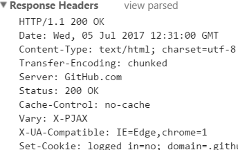
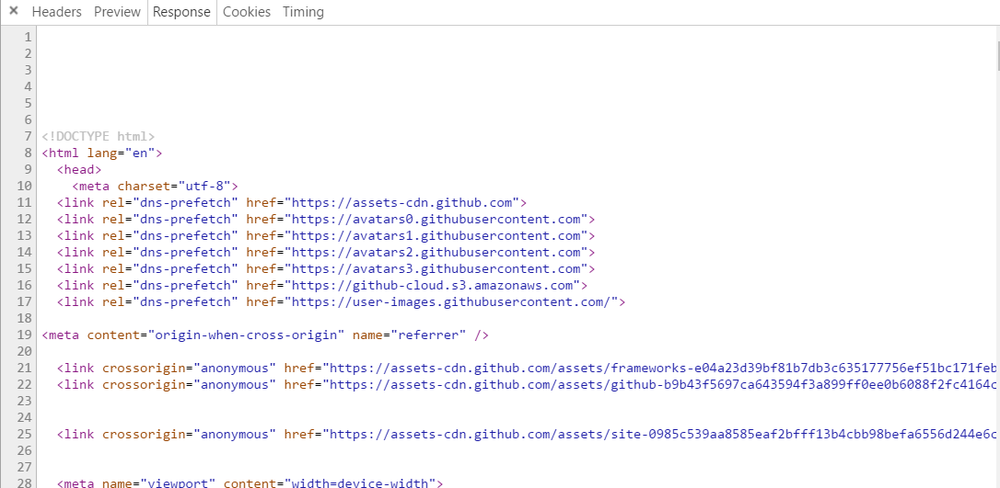

# HTTP协议

## HTTP URL

HTTP URL格式为:
>http://host[:port][abs_path]

* http 表示通过HTTP协议来定位网络资源
* host 表示主机域名或IP地址
* port 表示端口号，默认端口为80
* abs_path 指定请求资源的URI
> 若abs_path 为空，则必须给出'/'，在日常使用过程中，该步骤由浏览器完成

### Question

以下HTTP URL在浏览器中均可打开百度首页，但哪些是符合HTTP协议规范的？
1. www.baidu.com
1. http://www.baidu.com/
1. http://www.baidu.com:80
1. http://www.baidu.com:80/

## HTTP 请求

HTTP请求由三部分组成，分别为：请求行、报文头、请求正文


* 请求行

    请求行以请求方法开头，后面跟请求的URI和协议的版本，中间以空格隔开

    请求行格式如下：

    >Method Request-URI HTTP-Version CRLF

    >常用的Method有：
    >1. **GET**
    >1. **POST**
    >1. PUT
    >1. DELETE
    >1. HEAD(*)

* 报文头

    简单的说，服务器可以根据报文头中的数据来返回不同响应。具体的参数的用处将会在反爬虫中介绍。

* 请求正文

    包含了在请求响应时所需的额外数据。

### Question

1. GET和POST之间有什么区别？

## HTTP 响应

HTTP响应也是由三个部分组成，分别是：状态行、响应报头、响应正文





* 状态行

    状态行格式如下：
    >HTTP-Version Status-Code Reason-Phrase CRLF
    
    其中：
    * HTTP-Version 表示服务器的HTTP协议版本
    * Status-Code 表示服务器返回的响应状态代码
    * Reason-Phrase 表示该状态代码的文本描述

    常见的状态代码有：
    * 200 OK
        >客户端请求成功

    * 400 Bad Request
        >客户端请求有语法错误，不能被服务器所理解

    * 401 Unauthorized
        >请求未经授权

    * 403 Forbidden
        >服务器收到请求，但是拒绝提供服务

    * 404 Not Found
        >请求资源不存在，eg：输入了错误的URL

    * 500 Internal Server Error
        >服务器发生不可预期的错误

    * 503 Server Unavailable
        >服务器当前不能处理客户端的请求，一段时间后可能恢复正常

* 响应报头

    包含额外的响应信息、关于服务器的信息和对Request-URI所标识的资源进行下一步访问的信息。

* 响应正文

    包含所请求的资源数据。

### Question

1. 各个常见状态码所出现的常见场景为什么？

# HTML

这里先引用[w3school](http://www.w3school.com.cn/html/html_intro.asp)的几段话来解释一下HTML。

>## 什么是 HTML？
>
>HTML 是用来描述网页的一种语言。
>* HTML 指的是超文本标记语言 (Hyper Text Markup Language)
>* HTML 不是一种编程语言，而是一种标记语言 (markup language)
>* 标记语言是一套标记标签 (markup tag)
>* HTML 使用标记标签来描述网页
>
>## HTML 标签
>* HTML 标记标签通常被称为 HTML 标签 (HTML tag)。
>* HTML 标签是由尖括号包围的关键词，比如 <html>
>* HTML 标签通常是成对出现的，比如 <b> 和 </b>
>* 标签对中的第一个标签是开始标签，第二个标签是结束标签
>* 开始和结束标签也被称为开放标签和闭合标签
>
>## HTML 文档 = 网页
>
>* HTML 文档描述网页
>* HTML 文档包含 HTML 标签和纯文本
>* HTML 文档也被称为网页
>
>Web 浏览器的作用是读取 HTML 文档，并以网页的形式显示出它们。浏览器不会显示 HTML 标签，而是使用标签来解释页面的内容：
>```
><html>
><body>
>
><h1>My First Heading</h1>
>
><p>My first paragraph.</p>
>
></body>
></html>
>
>```
>例子解释
>```
><html> 与 </html> 之间的文本描述网页
><body> 与 </body> 之间的文本是可见的页面内容
><h1> 与 </h1> 之间的文本被显示为标题
><p> 与 </p> 之间的文本被显示为段落
>```

更多的标签类型可以查看[W3school](http://www.w3school.com.cn/tags/index.asp)

## 标签属性

对于网络爬虫来说，常用的标签属性有：
* class
* id
* name
* href
* title
* ……

## 自主学习

[W3school](http://www.w3school.com.cn/html/index.asp)是相对不错的学习HTML的网站。不要求精通，但要能认识常见标签。