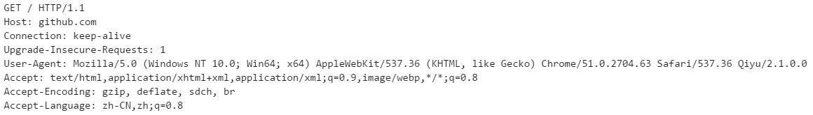

# HTTP协议

## HTTP URL

格式为:**http://host[:port][abs_path]**

* http 表示通过HTTP协议来定位网络资源
* host 表示主机域名或IP地址
* port 表示端口号，默认端口为80
* abs_path 指定请求资源的URI
> 若abs_path 为空，则必须给出'/'，在日常使用过程中，该步骤由浏览器完成

## HTTP 请求

HTTP请求由三部分组成，分别为：请求行、报文头、请求正文

